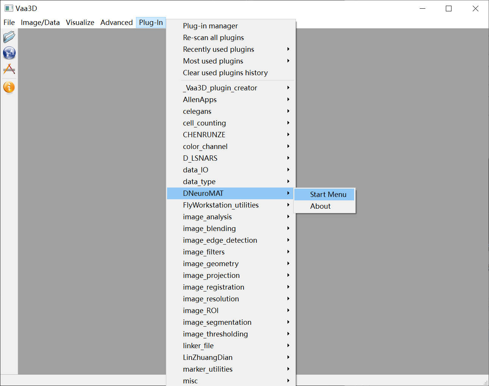
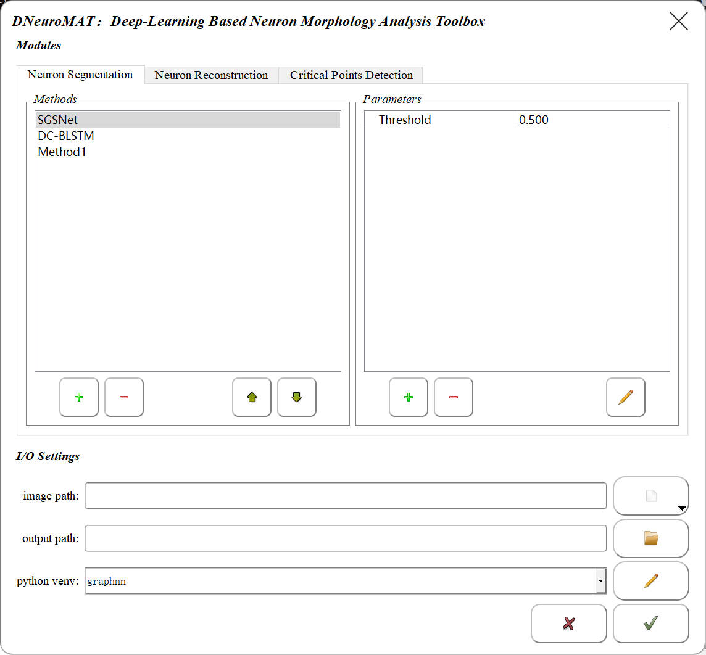
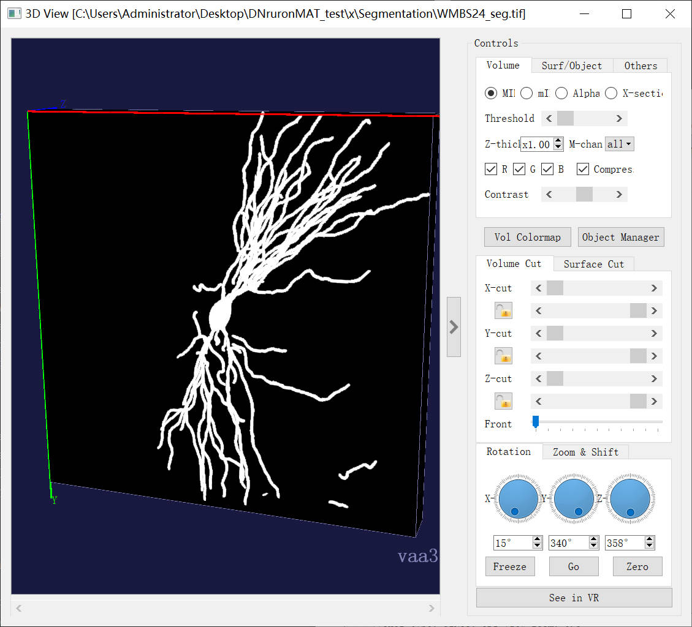
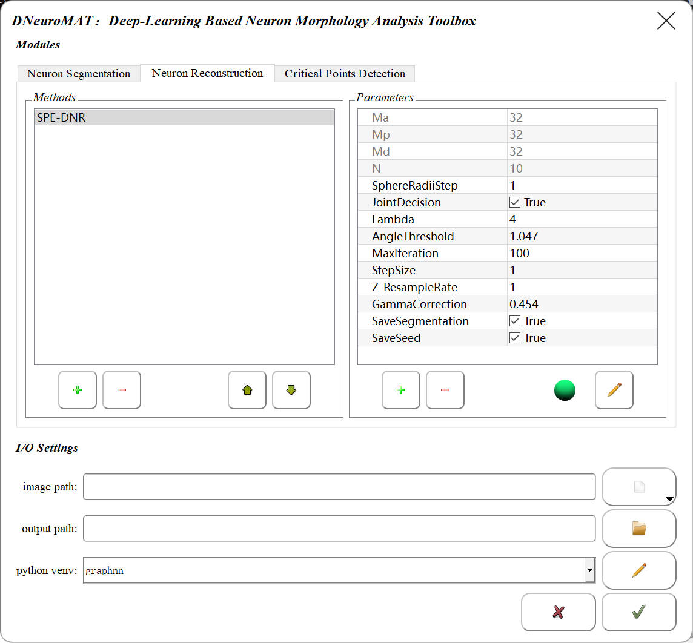
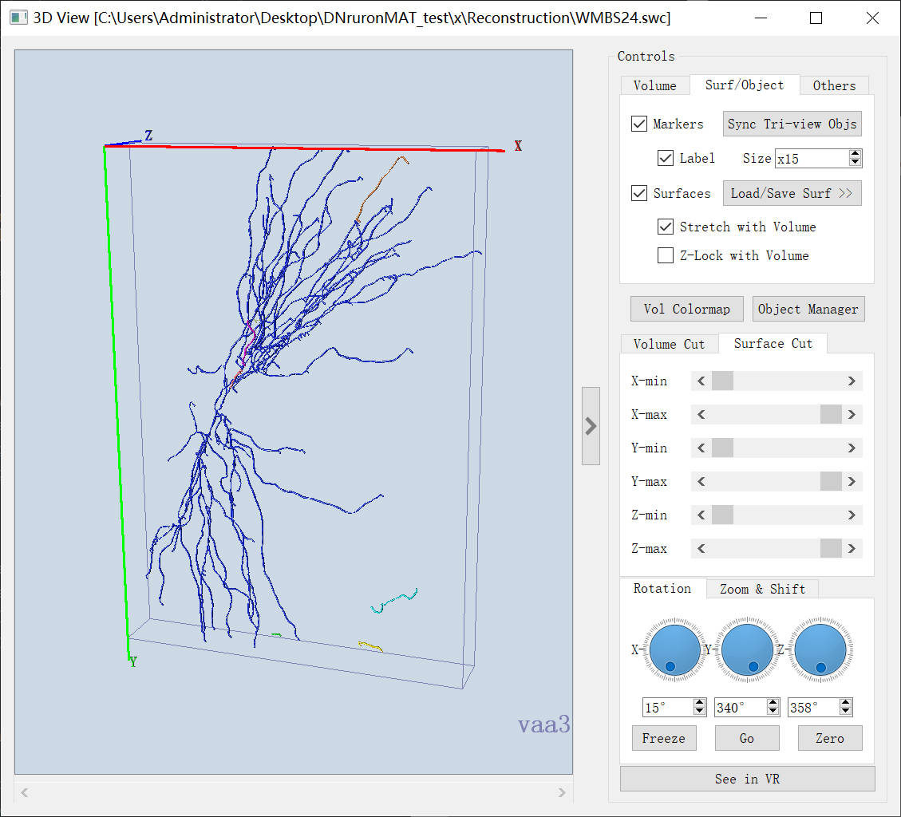
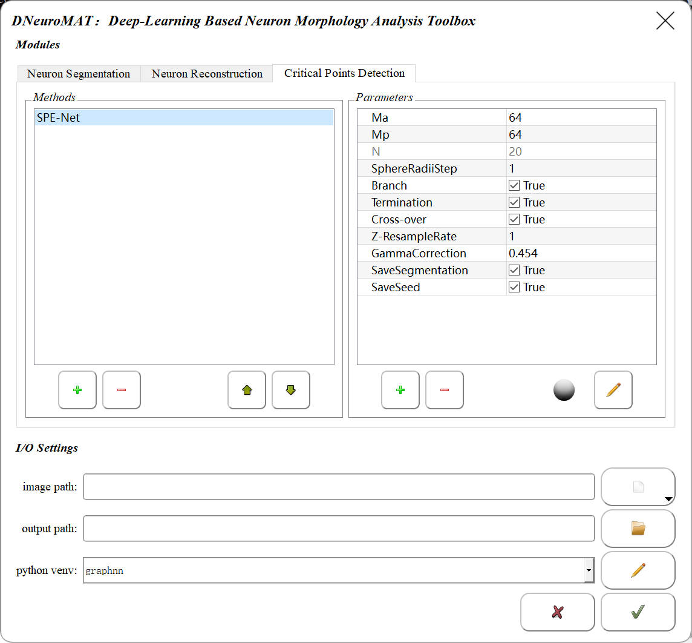
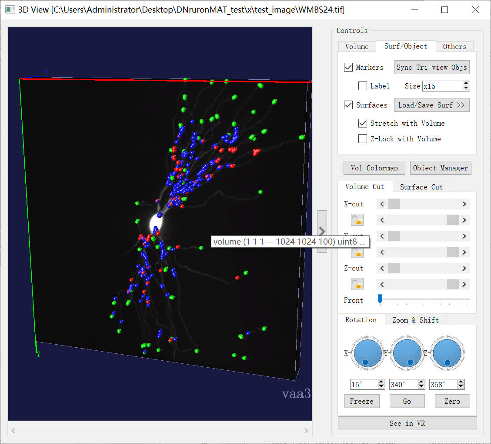

# DNeuroMAT
A Deep-Learning Based Neuron Morphology Analysis Toolbox

# Exemple Use Case of DNeuroMAT
## Concrete Content
The specific process can be referred to https://doi.org/10.1007/978-1-0716-3969-6_12


## Vaa3D Version and DNeuroMAT Install

The Present toolbox is built on Vaa3D with Qt version 4.8.6, https://github.com/Vaa3d.
Note：Strongly recommend to use Vaa3D with Qt version 4.8.6 for avoiding unexpected issues!
Refer to note 2 in the article for detailed installation steps of DNeuroMAT

## Python Environment
```
pip install -r ./DNeuroMAT/src/python/requirements.txt
```
Specific steps can be referred to the article in 'note 5'.

## How To Use
1. Test data is available at `./DNeuroMAT/data_for_test/test_image`
2. open Vaa3d and  find DNeuroMAT in plugin, if you already install it accord to note 2 in article.


### Neuron Segmentation
You can select the method and choose where to save the result.In example, we use test_image in `./DNeuroMAT/data_for_test/test_image/WMBS24.tif` 
and save at `./DNeuroMAT/data_for_test/Segmentation`.When the Segmentation progress is finished,it will auto open the result. 



### Neuron Reconstruction
if you choose the raw data(`./DNeuroMAT/data_for_test/test_image/WMBS24.tif`), please be sure to click the Segmentation Checker Button(Green ON, gray OFF).
In example, we use the raw data(Turn on the Button(Green) to make sure the segmentation algorithm runs),
the results save at `./DNeuroMAT/data_for_test/Reconstruction`.



### Critical Points Detection
similar to Neuron Reconstruction,choose the raw data(`./DNeuroMAT/data_for_test/test_image/WMBS24.tif`),click the button(make it green).
the results save at `./DNeuroMAT/data_for_test/Critical_Point_Detection`.



## Cite
Please cite if you use DNeuroMAT in your own work:
```
    @incollection{liu2024dneuromat,
    title={DNeuroMAT: A Deep-Learning-Based Neuron Morphology Analysis Toolbox},
    author={Liu, Min and Lin, Zhuangdian and Chen, Weixun and Meijering, Erik and Wang, Yaonan},
    booktitle={Neuronal Morphogenesis: Methods and Protocols},
    pages={179--197},
    year={2024},
    publisher={Springer}
    }
```